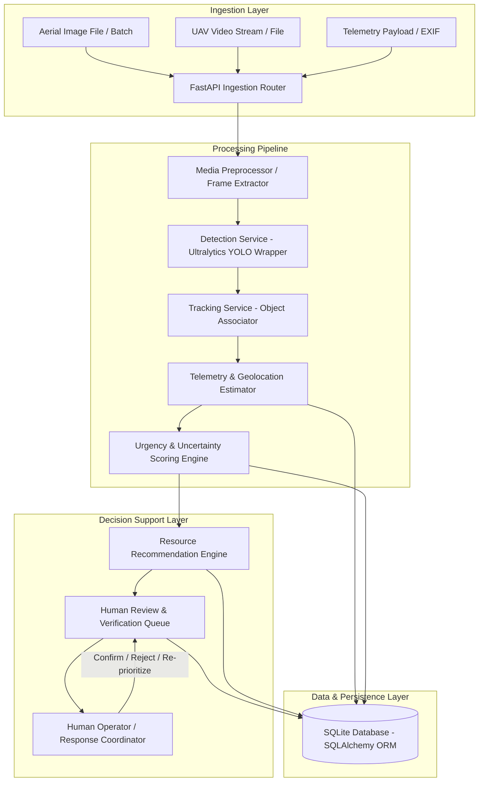

# System Architecture Document

**Project:** AI-Enabled UAV System for Real-Time Disaster Assessment, Potential Survivor Detection, and Emergency Resource Allocation  
**Document Version:** 1.0.0 (Phase 0 Planning)  
**Status:** Approved for Prototype Design  

---

## 1. Executive Summary & Purpose

This system is a **software-first, human-in-the-loop decision-support platform** engineered to process aerial images and video feeds captured by Unmanned Aerial Vehicles (UAVs) in post-disaster environments. 

The primary purpose is to assist disaster response coordinators by:
1. Identifying and tracking **potential survivors** ("person" detections) and visible hazards (e.g., debris, fire, flooding).
2. Associating UAV sensor and flight telemetry to estimate approximate ground coordinates.
3. Quantifying **urgency** and **detection uncertainty** to prioritize incidents for human inspection.
4. Generating advisory recommendations for emergency resource allocation (personnel, medical supplies, search teams).
5. Enforcing a strict human review boundary before any decision or emergency dispatch can be executed.

---

## 2. Safety, Terminology, and Ethical Boundaries

In strict compliance with the Project Safety Constitution:
* **Detection Terminology:** The system uses exclusively the terms `"person"` or `"potential survivor"`. The system **never** designates an entity as `"confirmed survivor"` or infers biological state (alive, deceased, injured, or trapped) from computer vision alone.
* **Advisory Only (No Auto-Dispatch):** The software provides read-only recommendations. It does **not** interface with real emergency dispatch services or automatically deploy rescue personnel.
* **No Flight Hardware Control:** The software does not control UAV flight paths, autopilots (e.g., ArduPilot/PX4), or physical drone hardware.
* **Synthetic & Simulated Data Transparency:** All synthetic drone telemetry, simulated GPS coordinates, and mock imagery are explicitly flagged with `is_synthetic: true` across schemas, database fields, and API outputs.
* **Mandatory Human-in-the-Loop Review:** No consequential operational status change or resource commitment can occur without explicit human verification (`reviewed_by`, `review_status`, `reviewed_at`).

---

## 3. High-Level System Architecture

The initial prototype is built around a modular monolithic architecture with clean service boundaries:

---

## 4. Subsystem Breakdown

### 4.1 Ingestion & Preprocessing Subsystem (`app.services.preprocessor`)
* Accepts standard aerial imagery (`.jpg`, `.png`) and UAV video formats (`.mp4`, `.mov`).
* Validates image resolutions, dimensions, color profiles, and MIME types.
* Extracts frame sequences from video at configurable sampling rates (e.g., 1 frame every $N$ seconds or keyframes) to conserve compute.
* Extracts embedded EXIF metadata (GPS tags, camera gimbal pitch/yaw, focal length, altitude) when available, falling back to simulated flight logs.

### 4.2 Detection & Tracking Subsystem (`app.services.detector`, `app.services.tracker`)
* Wraps the `ultralytics` YOLO model behind an abstract interface (`BaseDetector`) allowing seamless replacement with mock detectors for testing or fine-tuned aerial models in later phases.
* Operates on normalized bounding boxes with associated confidence scores.
* Implements a lightweight tracker (IoU / Centroid Associator) to assign persistent tracking IDs across consecutive frames, preventing duplicate count inflation of the same person.

### 4.3 Geolocation & Telemetry Subsystem (`app.services.geo_estimator`)
* Pairs visual frame detections with UAV telemetry (drone latitude, longitude, altitude above ground level, gimbal pitch, camera FOV).
* Computes approximate ground coordinates using projection geometry or centroid offset estimation.
* Explicitly marks coordinates derived without high-precision RTK/DEM elevation models as **approximations with error radii**.

### 4.4 Urgency & Uncertainty Scoring Engine (`app.services.scorer`)
* **Urgency Score ($S_{urgency} \in [0.0, 1.0]$):** Calculated from contextual signals including:
  * Proximity to recognized hazards (fire, debris, flood).
  * Density / count of detected people in a localized cluster.
  * Environmental exposure / accessibility indicators.
* **Uncertainty Score ($S_{uncertainty} \in [0.0, 1.0]$):** Derived from:
  * Model bounding box confidence ($1.0 - \text{confidence}$).
  * Video stability / motion blur index.
  * Distance/pixel resolution of detected person (Ground Sampling Distance).
* **Priority Tiering:** Classifies detections into `CRITICAL_REVIEW`, `HIGH`, `MEDIUM`, and `LOW` priority for operator triaging.

### 4.5 Resource Recommendation Engine (`app.services.recommender`)
* Evaluates active incidents against an inventory of simulated emergency resources:
  * Search and Rescue (SAR) ground teams.
  * Medical first-response units.
  * Water rescue / boat units.
  * Heavy clearing equipment / technical rescue.
* Calculates resource suitability based on estimated distance, terrain hazard type, and urgency level.
* Outputs an **advisory plan** containing suggested resource IDs, estimated response rationale, and required operator confirmation flags.

### 4.6 Persistence & API Layer (`app.db`, `app.api`)
* **SQLAlchemy ORM + SQLite:** Manages schemas for Missions, Aerial Frames, Detections, Incidents, Emergency Resources, and Human Review Logs.
* **FastAPI Backend:** Exposes RESTful endpoints with strictly validated Pydantic request/response models. Includes OpenAPI documentation and health-check endpoints.

---

## 5. Technology Stack Summary

| Layer | Technology | Rationale |
| :--- | :--- | :--- |
| **Language** | Python 3.11 | Modern typing, performance improvements, wide ML ecosystem compatibility |
| **API Framework** | FastAPI | High throughput, asynchronous capability, native Pydantic validation |
| **Data Validation** | Pydantic v2 | Robust schema definitions, strict type checking, serialization |
| **Database** | SQLite + SQLAlchemy 2.0 | Zero-setup local prototype, lightweight, easily upgradeable to PostgreSQL |
| **Vision / AI** | Ultralytics YOLO + OpenCV | Industry standard for real-time edge object detection and frame processing |
| **Testing** | pytest | Fixture-rich test suite with complete isolation from hardware and network |
| **Code Quality** | ruff | Ultra-fast linting and code formatting conforming to PEP 8 |

---

## 6. Distinction: Prototype vs. Future Research

| Dimension | Initial Prototype Scope | Future Research / Post-Prototype |
| :--- | :--- | :--- |
| **Model Deployment** | Standard CPU/CUDA YOLO inference on local machine | Edge-optimized TensorRT / OpenVINO / Coral Edge TPU |
| **Drone Integration** | File-based image/video upload + simulated telemetry | Live RTSP/WebRTC streams + MAVLink telemetry protocol |
| **Geolocation** | Planar ray-casting / flat-ground projection with error radius | Digital Elevation Model (DEM) ray-marching & visual SLAM |
| **Sensors** | Standard RGB imagery | Multi-spectral, thermal infrared (FLIR), LiDAR point clouds |
| **User Interface** | Swagger / OpenAPI REST endpoints | Real-time geospatial map dashboard (Leaflet/Mapbox + React) |
