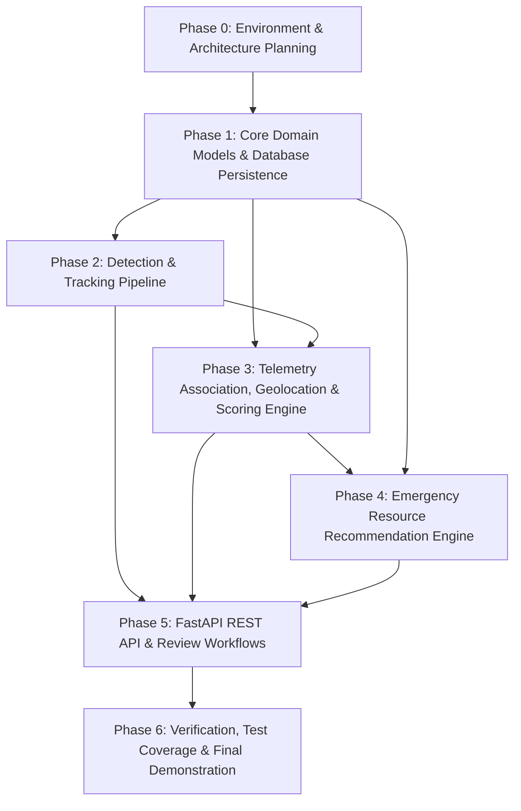

# Implementation Phase Plan & Dependency Roadmap

**Project:** AI-Enabled UAV System for Real-Time Disaster Assessment  
**Document Version:** 1.0.0 (Phase 0 Planning)  

---

## 1. Roadmap Overview

The development roadmap is divided into structured, sequential phases. Each phase is independently testable and builds incrementally on the foundational contracts established in preceding phases.

---

## 2. Detailed Phase Breakdown

### Phase 0: Environment & Architecture Planning *(Current)*
* **Objective:** Establish foundational constraints, safety boundaries, architecture, risk matrix, and technical contracts.
* **Dependencies:** None.
* **Deliverables:**
  * System Architecture Document (`docs/architecture.md`).
  * Phase Plan with Dependencies (`docs/phase_plan.md`).
  * Target Folder Structure (`docs/folder_structure.md`).
  * Assumptions and Unresolved Decisions (`docs/assumptions_and_decisions.md`).
  * Risk and Safety Analysis (`docs/risk_assessment.md`).
* **Verification:** Documentation review against Project Constitution.

---

### Phase 1: Core Domain Models, Configuration & Database Persistence
* **Objective:** Create the database models, Pydantic validation schemas, and configuration layer.
* **Dependencies:** Phase 0.
* **Deliverables:**
  * `app/core/config.py`: Environment-driven settings (database URI, mock flags, threshold parameters).
  * `app/models/`: SQLAlchemy ORM models:
    * `Mission`: Disaster incident event / flight mission session.
    * `AerialFrame`: Video frame or uploaded static photo with timestamp & telemetry link.
    * `Detection`: Identified object (label `"person"` / hazard, bounding box, confidence, tracking ID, ground coordinates).
    * `Resource`: Available emergency unit (personnel count, equipment type, status, location).
    * `ResourceRecommendation`: Advisory assignment linked to an incident/detection.
    * `HumanReviewLog`: Audit record of human reviewer action (accepted, rejected, modified priority).
  * `app/schemas/`: Pydantic validation schemas corresponding to all domain entities.
  * `app/db/session.py`: Database engine, scoped session factory, Base model, and table initialization.
* **Verification:** Unit tests verifying schema validation, database table creation, and CRUD operations using in-memory SQLite.

---

### Phase 2: Detection & Tracking Pipeline
* **Objective:** Build an extensible aerial image/video processing service with support for object tracking and mockable inference.
* **Dependencies:** Phase 1.
* **Deliverables:**
  * `app/services/detector.py`: `BaseDetector` interface with `YOLOAerialDetector` implementation and `MockDetector` for deterministic, zero-network unit testing.
  * `app/services/preprocessor.py`: OpenCV frame reader, video keyframe extractor, image dimension validator.
  * `app/services/tracker.py`: IoU/Centroid object tracker maintaining consistent tracking IDs across frame sequences.
* **Verification:** Unit tests verifying frame extraction, detection bounding box normalization, and consistent tracking IDs across multiple synthetic frames without requiring GPU or live model downloads.

---

### Phase 3: Telemetry Association, Geolocation & Scoring Engine
* **Objective:** Map 2D pixel coordinates to approximate ground coordinates using UAV telemetry, and compute urgency and uncertainty scores.
* **Dependencies:** Phase 1, Phase 2.
* **Deliverables:**
  * `app/services/geo_estimator.py`: Planar ray-projection / pinhole camera model mapping $(u, v)$ pixel coordinates to simulated $(lat, lon)$ ground coordinates using UAV altitude and gimbal angles.
  * `app/services/scorer.py`:
    * Urgency metric ($S_{urgency}$) computed from person density, distance to hazards, and environmental signals.
    * Uncertainty metric ($S_{uncertainty}$) computed from detection confidence, motion blur score, and pixel resolution.
    * Composite priority classifier (`CRITICAL_REVIEW`, `HIGH`, `MEDIUM`, `LOW`).
* **Verification:** Deterministic mathematical unit tests covering coordinate projection edge cases and scoring bounds $[0.0, 1.0]$.

---

### Phase 4: Emergency Resource Recommendation Engine
* **Objective:** Implement a decision-support recommender that matches prioritized potential survivor detections to available rescue resources for human review.
* **Dependencies:** Phase 1, Phase 3.
* **Deliverables:**
  * `app/services/recommender.py`:
    * Resource suitability matrix (e.g., medical team for high urgency, boat/flotation for flood zones, search team for dispersed detections).
    * Distance and travel-time estimator based on simulated coordinates.
    * Human confirmation requirement flag (`requires_human_authorization = True`).
* **Verification:** Unit tests verifying that no automatic dispatch occurs, valid recommendations are generated according to hazard type, and out-of-stock resources are handled gracefully.

---

### Phase 5: FastAPI REST API & Human Review Workflows
* **Objective:** Expose clean HTTP endpoints for uploading media, querying detections, reviewing prioritization queues, and recording human verification decisions.
* **Dependencies:** Phases 1 through 4.
* **Deliverables:**
  * `app/api/v1/endpoints/`:
    * `missions.py`: Mission registration and status tracking.
    * `media.py`: Image and video file upload and processing triggers.
    * `detections.py`: Querying detected potential survivors and hazards with spatial filters.
    * `recommendations.py`: Retrieval of advisory resource plans.
    * `reviews.py`: Operator review endpoint (`POST /reviews/{detection_id}`) recording human approval, rejection, or reassessment.
  * `app/main.py`: FastAPI application initialization, CORS middleware, global exception handlers, and health-check endpoint.
* **Verification:** TestClient integration tests verifying HTTP endpoints, request validation, error responses, and database state transitions.

---

### Phase 6: Verification, Test Coverage & Final Demonstration
* **Objective:** Complete end-to-end integration validation, comprehensive documentation, and sample disaster scenario demonstrations.
* **Dependencies:** All previous phases.
* **Deliverables:**
  * End-to-end mocked disaster flight mission test suite.
  * Ruff linting and formatting compliance across all files.
  * Updated README with step-by-step API walkthrough and sample curl commands.
* **Verification:** Complete pytest test suite passing cleanly with zero warnings, zero flake, and zero external network calls.
